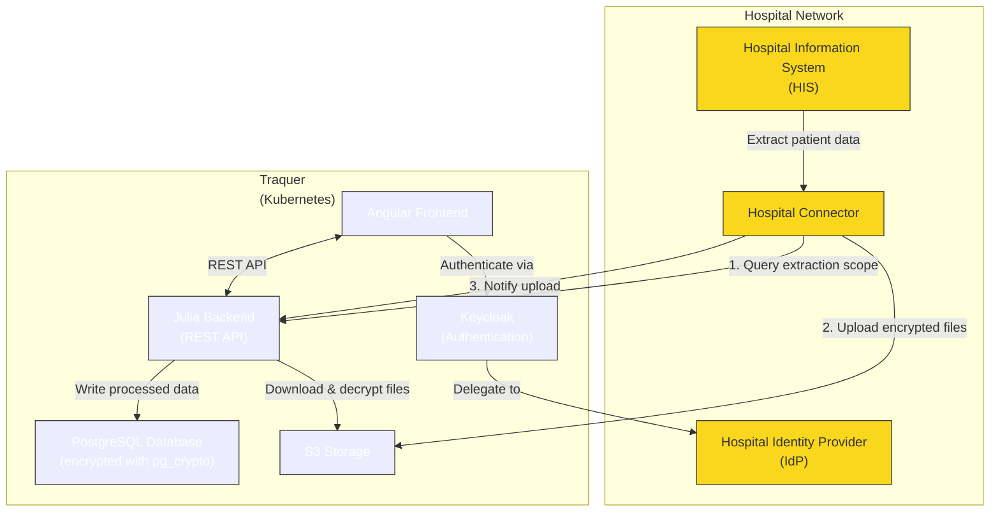

# TRAQUER.jl

## Architecture Overview



**Key components:**
- **Hospital Information System (HIS)**: Source of truth for patient data, stays, and lab results
- **Hospital Connector**: Installed in hospital network, extracts data from HIS, encrypts files, and uploads to Traquer
- **Hospital Identity Provider (IdP)**: Authenticates hygiene department users
- **Angular Frontend**: User interface for the hygiene department
- **Julia Backend**: REST API handling business logic, file processing, and encryption
- **PostgreSQL Database**: Stores encrypted patient data using pg_crypto
- **Keycloak**: Manages user authentication with delegation to hospital IdP
- **S3 Storage**: Storage service for encrypted file exchange

## Loom presentation

https://www.loom.com/share/8d03385a9ef54b9ba7c8e3042c54b3ba

## E2E
see [integration-test-accidental_discovery_and_epidemic.jl](custom/demo/test/sample-input-data/accidental_discovery_and_epidemic/integration-test-accidental_discovery_and_epidemic.jl)


## Status
An event (`EventRequiringAttention`) is alway related to an infectious status (`InfectiousStatus`).
An infectious status can be related to zero, one or multiple outbreaks via instances of
`OutbreakInfectiousStatusAsso` (Eg. of multiple associations, one outbreak for the
hospitalization where the patient was found positive ; another outbreak for a new hospitalization
of that same patient).

An infectious status (`InfectiousStatus`) are used to deduce the stays where the patient are
at risk using function `
        StayCtrl.getStaysWherePatientAtRisk(
            atRiskStatus::InfectiousStatus,
            dbconn::LibPQ.Connection
        )`


## Scheduler

### Permanently Add/Remove
To add/remove a function or change the timing of execution of a scheduled function. No need
to restart the application, you can just restart the scheduler
```
TRAQUER.stopScheduler()
TRAQUER.startScheduler()
```

### Enable/Disable a function
To enable/disable a function for an environment, do not remove it from the code, use the
blacklist in the configuration file (`scheduler.blacklist`).

**NOTE:** No need to restart the scheduler.
