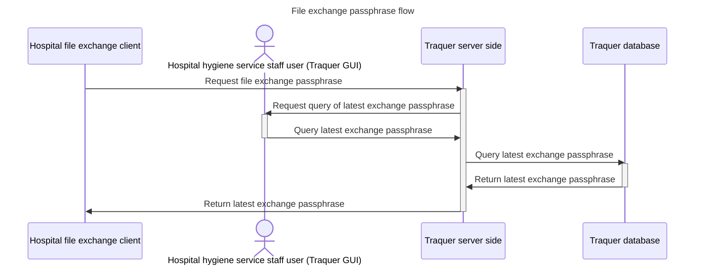
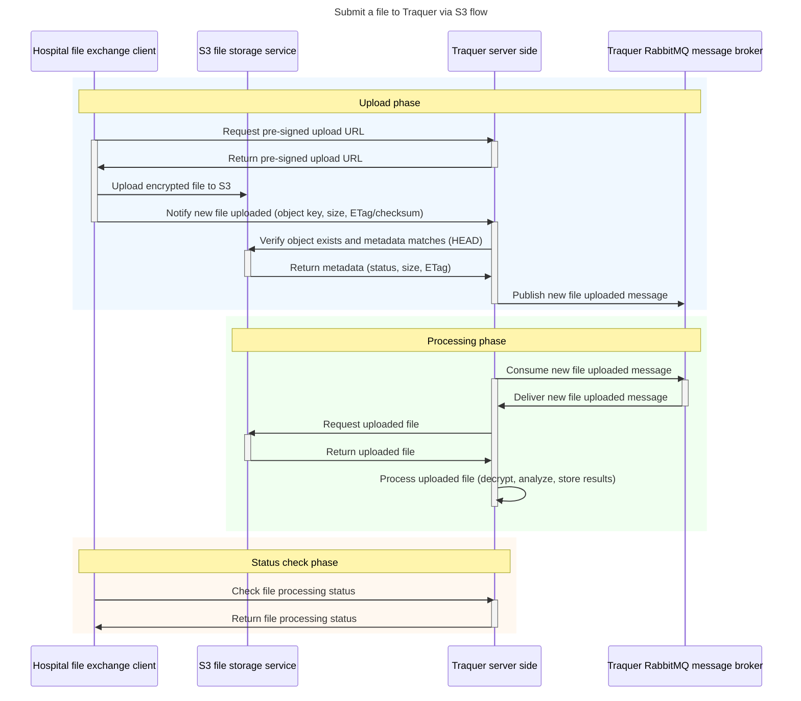
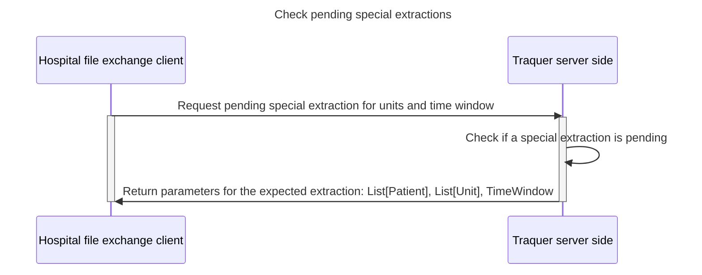

# File gateway

## Get a file exchange passphrase

The hospital client needs to get the latest file exchange passphrase from Traquer in order
to encrypt files before uploading them to S3.
A file exchange passphrase can be used multiple times until it is rotated by Traquer. Using
an old passphrase will work but will be logged for security auditing purposes and trigger
an alert to the referers and admins of the hospital and of Traquer.

## Submit a file to Traquer via S3 flow
This diagram illustrates the flow of submitting a file to Traquer via S3 storage service.

## Check existence of a pending special extraction
This diagram illustrates the flow of checking if an extraction with a specific perimeter of
units and time window is needed. Those special extractions are needed when Traquer is
missing data to compute the outbreak.

