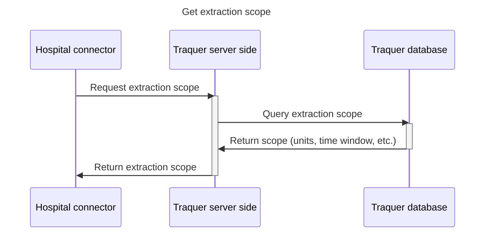
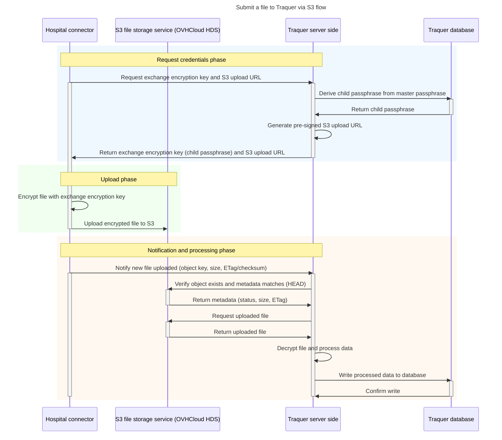

# File gateway

NOTE: The following documentation intentionally omits the machine-2-machine authentication.
But in practice, all requests from the hospital connector to Traquer server side
must be authenticated using mTLS x.509 certificates.

## Overview

The file exchange between Traquer and the hospital connector follows this workflow:

1. The connector asks Traquer for the scope of movement data to extract
2. The connector generates the corresponding FHIR XML file
3. The connector requests an exchange encryption key and an S3 upload URL from Traquer
4. The connector encrypts the file using a child passphrase derived from the master passphrase
5. The connector uploads the file to S3
6. The connector notifies Traquer that the file is available
7. Traquer downloads the file, decrypts it, and processes it to update the database

## Get the scope of data to extract

The connector queries Traquer to know what data needs to be extracted. This includes
which units and time windows are relevant for the extraction.

```mermaid
sequenceDiagram
title Get extraction scope

%% Participants
participant C as Hospital connector
participant TS as Traquer server side
participant TDB as Traquer database

%% Messages
C->>TS: Request extraction scope
activate TS

TS->>TDB: Query extraction scope
activate TDB
TDB->>TS: Return scope (units, time window, etc.)
deactivate TDB

TS->>C: Return extraction scope
deactivate TS
```

## Submit a file to Traquer via S3

This diagram illustrates the complete flow of submitting a file to Traquer via S3 storage service.

```mermaid
sequenceDiagram
title Submit a file to Traquer via S3 flow

%% Participants
participant C as Hospital connector
participant S3 as S3 file storage service (OVHCloud HDS)
participant TS as Traquer server side
participant TDB as Traquer database

rect rgb(240,248,255)
note over C,TS: Request credentials phase
C->>TS: Request exchange encryption key and S3 upload URL
activate C
activate TS
TS->>TDB: Derive child passphrase from master passphrase
activate TDB
TDB->>TS: Return child passphrase
deactivate TDB
TS->>TS: Generate pre-signed S3 upload URL
TS->>C: Return exchange encryption key (child passphrase) and S3 upload URL
deactivate TS
end

rect rgb(240,255,240)
note over C,S3: Upload phase
C->>C: Encrypt file with exchange encryption key
C->>S3: Upload encrypted file to S3
deactivate C
end

rect rgb(255,248,240)
note over C,TS: Notification and processing phase
C->>TS: Notify new file uploaded (object key, size, ETag/checksum)
activate C
activate TS
TS->>S3: Verify object exists and metadata matches (HEAD)
activate S3
S3->>TS: Return metadata (status, size, ETag)
deactivate S3
TS->>S3: Request uploaded file
activate S3
S3->>TS: Return uploaded file
deactivate S3
TS->>TS: Decrypt file and process data
TS->>TDB: Write processed data to database
activate TDB
TDB->>TS: Confirm write
deactivate TDB
deactivate TS
deactivate C
end
```

## Encryption

Traquer uses a master passphrase known only by the hygiene department to derive child
passphrases. Child passphrases are short-lived and used for:

- Encrypting files exchanged with the hospital connector
- Deriving encryption keys for database-level encryption (via pg_crypto)

The connector receives a child passphrase when requesting upload credentials, and uses it
to encrypt the file before uploading to S3.
